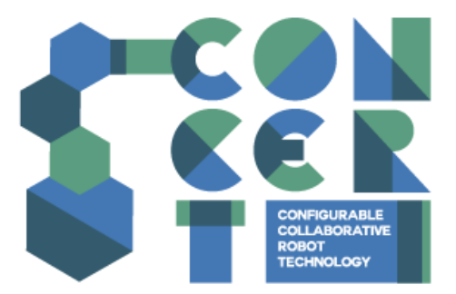
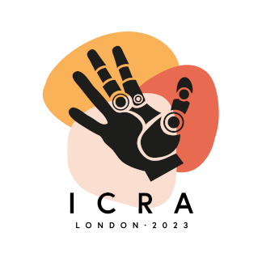

# London Robotics & AI Summer Mini-School

|  |
| :---: |

Join us at the Mile End Campus of Queen Mary University of London for the first pilot of the London Robotics & AI Summer School, jointly organised by Queen Mary University of London (QMUL) and University College London (UCL). This first edition will be a one-day event (i.e. a Mini-School), with presentations by academics of QMUL, UCL and Imperial College, followed by a short robotic hackathon in which you will be challenged to update the ROS code of a small robotic arm to pick as many objects as you can in the shortest possible time: can you beat our robot baseline?

The event is free! But places are limited (first come, first served). You'll need to sign up to participate (registration opens on 04/05/2023 here: https://www.eventbrite.co.uk/e/london-robotics-ai-summer-mini-school-tickets-625127672697).

[Tasks](tasks.md)

|  |  |  |
|--- | --- | --- |
