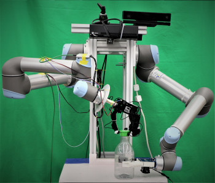

**Date:** 6 June 2023 08:00 - 19:00

**Location:** QMUL, Arts Two Lecture Theatre, Mile End Campus, E1 4FQ

[ 📍 MAP 📍 ](https://goo.gl/maps/m46p3Ws6K86j7RYy7)

Join us at the Mile End Campus of Queen Mary University of London for the first pilot of the London Robotics & AI Summer School, jointly organised by Queen Mary University of London (QMUL) and University College London (UCL). This first edition will be a one-day event (i.e. a Mini-School), with presentations by academics of QMUL, UCL and Imperial College, followed by a short robotic hackathon in which you will be challenged to update the ROS code of a small robotic arm to pick as many objects as you can in the shortest possible time: can you beat our robot baseline?

**Programme** (this is a "Bring Your Own Laptop" event, if you want to code!)

* 8:00-9:30 Registration and Breakfast
* 9:30-10:00 Welcome and Introduction
* 10:00-10:40 A Robotic Sense of Touch (Dr Lorenzo Jamone, QMUL)
* 10:40-11:20 Computer Vision for Intelligent Robots (Dr Dimitrios Kanoulas, UCL)
* 11:20-12:00 Imitation Learning for Robot Control (Dr Edward Johns, IC)
* 12:00-13:00 Lunch and informal Students-Speakers discussion
* 13:00-15:30 Mini-Hackathon (part #1): code my robot (can you beat the baseline?)
* 15:30-16:00 Coffee Break
* 16:00-17:30 Mini-Hackathon (part #2): presentation of results and closing
* 17:30-19:00 Drinks reception

The event is partially supported by the Alan Turing Institute (https://www.turing.ac.uk), by DERI (https://www.qmul.ac.uk/deri) and by CRISP (https://lorejam.wixsite.com/crisp).

 ---

[ 🤖 **Tasks** 🤖 ](tasks.md)

 ---

[ 💻 **Provided Code** 🤖 ](https://drive.google.com/drive/folders/1-Kni6YgTj-TUEOGt0LPY9M0K-nPpPJsM?usp=sharing) 

 ---

[ 💻 **Code Share!** Please upload your codes here! 💻 ](https://drive.google.com/drive/folders/1-Kni6YgTj-TUEOGt0LPY9M0K-nPpPJsM?usp=sharing) 

