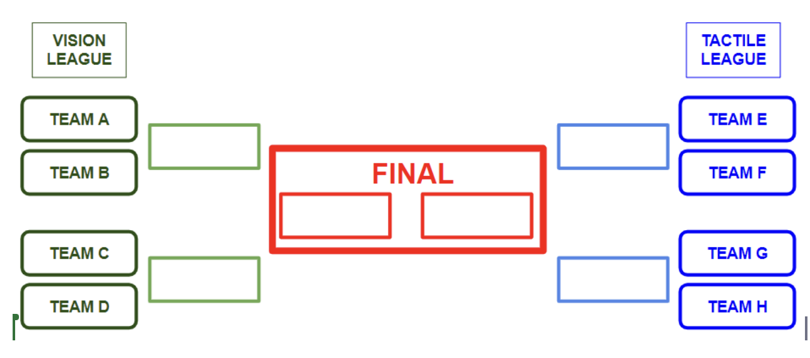

|  |

Two tasks:

A: (tactile/visual) object localization;
B: (tactile/visual) exploration
C: haptic object recognition.

**Task A**
Mr White robot arm, with gripper.
(add tactile sensors on the gripper, QMUL, or a camera, UCL)
The target object sits on the table, within the arm workspace.
The arm moves to a random configuration (taken from a list of valid/safe configurations near to the table surface).
Some "local" exploration starts.
The gripper closes. 
The arm moves up to a fixed configuration over the table.
Gentle shaking.
Tha arm moves back to a fixed configuration near to the table.
Gripper opens.
The arm moves back to home configuration.

**Task B**
Mr White robot arm, with gripper.
(add tactile sensors on the gripper, QMUL, or a camera, UCL)
The target object sits on the table, within the arm workspace.
The arm moves to a random configuration 
(taken from a list of valid/safe configurations near to the table surface).
Exploration starts.
At the beginning, all configurations have the same probability of being selected.
step-1) One valid arm configuration is chosen from the list, based on probabilities.
step-2) The arm moves to such a configuration, and depending on touch/no-touch (or, visual feedback), the probability of the configuration is updated (either decreased or increased).
Step-1 and step-2 are repeated for N number of times (e.g. N=1000); 
probabilities are reset; 
a new exploration starts.

**Task C** (last resort, if MrWhite does not work)
Robotiq adaptive gripper, with one 2x2 flat tactile sensor (empty soft pad on the other side).
Gripper is open (fixed on the desk).
One object (among 10) is placed within the fingers.
Gripper closes and applies a "squeezing strategy" to recognize object.
Gripper opens.