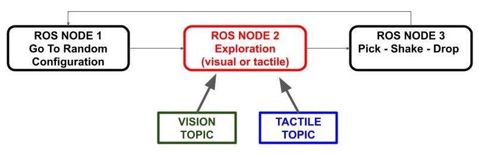
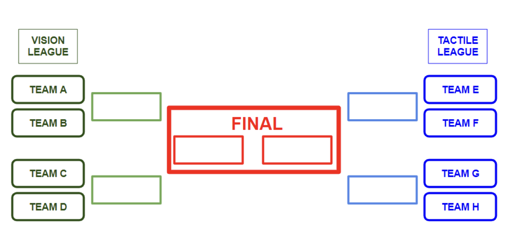

**One task:** Pick the object, shake it, put it back. As many times as possible, as successfully as possible.

**Two strategies:** Vision based or Tactile based.

### **Task**

We present you Mr White robot arm with gripper. We have two configurations: one with _tactile sensors_ on the gripper; the other one with _a camera_ attached to the gripper. 

The target object sits on the table, within the arm workspace.

**NODE 1**
The arm moves to a random joints-space configuration (taken from a list of valid/safe configurations near to the table surface, with gripper about 5 cm over the table).

**NODE 2**
_“Local exploration”_ starts. 

(This is the part of the code that the teams will have to update in the Hackathon; in the initial baseline we provide, the robot moves only.)

You are expected to update the provided code so that the gripper performs the tasks as below:

- The gripper finds the object.

- The gripper positions itself to perform the grasping. 

Currently, the random movements are set by Node 1. Working after this node, you will need to create a second node that will find the object. After the object is found, your node will initiate the third node that will perform grasp, shake and drop. In summary, we expect you to implement Node 2. 

**NODE 3**
The arm will perform grasping at the final position determined by Node 2. Then, it will  move and shake. We will assess if it drops the object. 

[]() 

***Your code:***

Create a ROS node that reads the information provided by the input node. By reading this information, the node should also move the arms to a position that would enable grasping the object. The code we provide performs the grasping and shaking. 

- Pay attention to the functions for reading the positions and moving the arm:

```python
# This function is to get the angles from the arm.
get_angles = rospy.ServiceProxy("get_joint_angles", GetAngles) 
# This function sets new angles for the arm to move. 
set_angles = rospy.ServiceProxy("set_joint_angles", SetAngles)
```

- _Tactile Team:_ 

	- You need to subscribe to the topic _magnetic_fingertip_zeroset_ in order to get information from the tactile sensor. It will give you the x, y, z points of each four taxel. You can subscribe by adding below code to your node script: 
 
		```python
		from arduino_magnetic_sensor.msg import xServerMsg, xSensorData
		rospy.Subscriber("magnetic_fingertip_zeroset", xServerMsg, callback_function)
		```

		You need to create your own callback_function inside the node that would process the message. 

	- Each time the arm changes position, you need to reset the sensor to callibrate. To reset call the service _/sensor_reset_. You initialise this service in your node by adding:

		```python
		from arduino_magnetic_sensor.srv import reset
		rospy.wait_for_service('sensor_reset')
		your_reset_name = rospy.ServiceProxy('sensor_reset', reset)
		```
		And everytime you need to reset, send true:

		```python
		your_reset_name(True)
		```


- _Vision Team:_ You need to 


- Update the launch file to activate the node you have created. 

Your _rqt_graph_ should look like this: 


---


**TEAMS:**

[]() 


